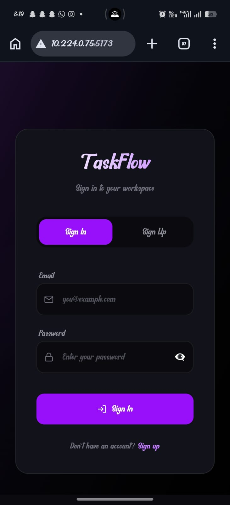
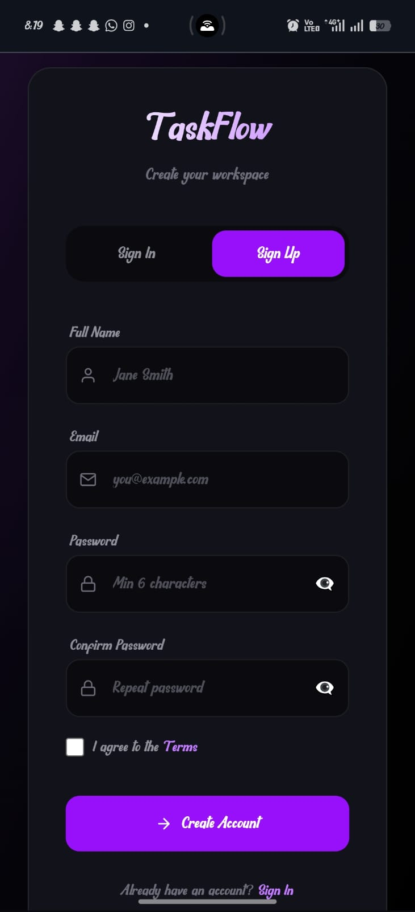

# TaskFlow ⚡

> A production-quality, offline-first Progressive Web Application for task management — built for the SDE I Full Stack Developer Assessment.


---

## 📋 Table of Contents

- [Project Description](#-project-description)
- [Features Implemented](#-features-implemented)
- [Screenshots](#-screenshots)
- [Tech Stack](#-tech-stack)
- [How to Run the App](#-how-to-run-the-app)
- [State Management Approach](#-state-management-approach)
- [Offline Sync Strategy](#-offline-sync-strategy)
- [AI Usage Disclosure](#-ai-usage-disclosure)
- [Known Issues & Limitations](#-known-issues--limitations)
- [Project Structure](#-project-structure)

---

## 📌 Project Description

**TaskFlow** is a modern task management PWA that delivers a native app-like experience on the web. Users can sign up, log in, and manage their tasks with full CRUD functionality — even without an internet connection.

The app is:
- **Installable** on desktop and mobile via Add to Home Screen
- **Offline-first** — works reliably without network connectivity using IndexedDB and Workbox service workers
- **Responsive** — adapts seamlessly across screen sizes

---

## ✅ Features Implemented

### Core Features
- 🔐 **Firebase Authentication** — Email & password signup and login
- ✅ **Form Validation** — Real-time validation with `react-hook-form` (blur mode)
- 🛡️ **Protected Routes** — Auth-gated pages with automatic redirects
- 📊 **Task Dashboard** — Stats cards (Total, Done, Pending) with progress bar
- 📝 **Full CRUD** — Create, Read, Update, Delete tasks
- ⚡ **Optimistic UI Updates** — Instant UI response before server confirms
- 🔍 **Search & Filter** — Filter by All / Active / Completed, search by title/description
- 📅 **Due Date Support** — Calendar date picker per task
- 📲 **PWA Installable** — Web App Manifest + Workbox service worker
- 📶 **Offline-First** — Firestore IndexedDB persistence + custom sync queue
- 🔔 **Push Notifications** — Firebase Cloud Messaging (FCM) with foreground & background support
- 🔄 **Background Sync** — Service Worker `sync` event with retry logic
- 🌐 **Network Status Indicator** — Live Online/Offline badge in navbar
- 🕓 **Pending Changes Counter** — Shows unsynced changes with manual sync button

### Bonus Features
- 🌙 **Dark Mode UI** — Default deep dark theme with purple accent system
- 💡 **Notification Permission Helper** — Browser-specific step-by-step unblock guide
- 🎞️ **Smooth Animations** — slide-up, slide-in CSS keyframe transitions

---

## 📸 Screenshots

> _Add your screenshots or screen recordings here_

| Signin | Signup | Dashboard | Offline Mode |
|-------|-------|-----------|--------------|
|  |  |  |  |

---

## 🛠 Tech Stack

| Category | Technology | Purpose |
|---|---|---|
| Frontend | React 18 | UI components & hooks |
| Build Tool | Vite | Dev server & bundling |
| Styling | Tailwind CSS v4 | Utility-first CSS |
| PWA | vite-plugin-pwa + Workbox | Service worker & manifest |
| Authentication | Firebase Auth | Email/password auth |
| Database | Cloud Firestore | Real-time task storage |
| Push Notifications | Firebase Cloud Messaging | Background + foreground push |
| Offline Queue | IndexedDB (custom syncService) | Pending changes queue |
| Forms | react-hook-form | Validation & form state |
| Routing | React Router v6 | SPA navigation |
| Toast | react-hot-toast | User feedback |
| Icons | react-icons (Feather) | UI icons |

---

## 🚀 How to Run the App

### Prerequisites
- Node.js >= 18.x
- npm >= 9.x
- A Firebase project with **Auth**, **Firestore**, and **Cloud Messaging** enabled

### 1. Clone the Repository

```bash
git clone https://github.com/mugunthanm2k/task-management-app.git
cd taskflow
```

### 2. Install Dependencies

```bash
npm install --legacy-peer-deps
```

### 3. Configure Environment Variables

Create a `.env` file in the project root:

```env
VITE_FIREBASE_API_KEY=your_api_key
VITE_FIREBASE_AUTH_DOMAIN=your_project.firebaseapp.com
VITE_FIREBASE_PROJECT_ID=your_project_id
VITE_FIREBASE_STORAGE_BUCKET=your_project.appspot.com
VITE_FIREBASE_MESSAGING_SENDER_ID=your_sender_id
VITE_FIREBASE_APP_ID=your_app_id
VITE_FIREBASE_VAPID_KEY=your_vapid_key
```

> **How to get VAPID key:** Firebase Console → Project Settings → Cloud Messaging → Web Push Certificates → Generate key pair

### 4. Firebase Setup

1. Go to [Firebase Console](https://console.firebase.google.com)
2. **Authentication** → Enable Email/Password provider
3. **Firestore** → Create database (test mode for development)
4. **Cloud Messaging** → Enable and copy the VAPID key
5. **Authentication** → Add your domain to Authorized Domains

### 5. Run the App

```bash
# Development server
npm run dev

# Production build
npm run build

# Preview production build (required for PWA/service worker testing)
npm run preview
```

> ⚠️ Service workers and PWA install prompts only activate on the **production preview** (`npm run preview`), not the dev server.

---

## 🧠 State Management Approach

TaskFlow uses a **hook-based, modular state architecture** — no Redux or Zustand.

### Structure

```
AuthContext       →  Global Firebase user state (React Context)
useTasks          →  Local tasks array with optimistic updates (useState)
useOfflineSync    →  Sync queue state: isSyncing, pendingCount, isOnline
useNetworkStatus  →  Listens to window online/offline events → boolean
useNotifications  →  Wraps notificationService methods for components
```

### Data Flow

```
User Action
  → useTasks (optimistic UI update instantly)
  → addToSyncQueue (writes to IndexedDB)
  → syncPendingChanges (calls Firestore if online)
  → On failure: rollback to previous state + toast error
```

State is kept **normalized and modular** — each hook owns its domain, and components only consume what they need via hook calls.

---

## 📡 Offline Sync Strategy

TaskFlow uses a **two-layer offline architecture**:

### Layer 1 — Firestore SDK Persistence

`enableIndexedDbPersistence(db)` is enabled in `firebaseConfig.js`. This caches all Firestore reads and queues writes automatically when offline, replaying them on reconnection.

### Layer 2 — Custom Sync Queue (`syncService.js`)

A custom IndexedDB store (`taskflow-sync` database, `pendingChanges` object store) explicitly tracks every CREATE / UPDATE / DELETE operation.

**Each record stores:**
```json
{
  "type": "UPDATE",
  "taskId": "abc123",
  "data": { "completed": true },
  "timestamp": 1710000000000,
  "retryCount": 0
}
```

### Sync Flow

```
Offline action  →  saved to IndexedDB  →  toast: "Saved offline"
                                              ↓
                                    Network comes back online
                                              ↓
                              useOfflineSync detects isOnline change
                                              ↓
                               syncPendingChanges() processes queue
                                              ↓
                          Success → remove from IndexedDB → toast "Synced!"
                          Failure → increment retryCount
                          5 failures → discard change (prevents infinite loop)
```

### Workbox Caching Strategies

| Asset Type | Strategy | TTL |
|---|---|---|
| Google Fonts | CacheFirst | 1 year |
| JS / CSS / Images | StaleWhileRevalidate | 30 days |
| App Shell | Pre-cached (autoUpdate) | On build |

### Background Sync (Service Worker)

The service worker registers a `sync-tasks` tag via the Background Sync API. This acts as a fallback to sync pending changes even when the browser tab is closed and the network returns.

---

## 🤖 AI Usage Disclosure

> Per the assessment policy, AI tool usage is documented below.

- **Claude (Anthropic)** — Used to assist with architecture planning, React hook design patterns (`useOfflineSync`, `useTasks`), IndexedDB sync queue implementation logic, and generating project documentation.
- All AI-generated code was **reviewed, tested, and integrated manually** by the developer.
- Final architecture decisions, Firebase configuration, UI design system, and component composition were made by the developer.

---

## ⚠️ Known Issues & Limitations

- **Unit tests not implemented** — Testing coverage is not included in this submission.
- **Tasks not scoped per user** — All authenticated users currently see the same Firestore task collection. A `userId` field and `where("userId", "==", currentUser.uid)` query filter should be added for production.
- **`removePendingChange()` in `service-worker.js` is a stub** — The background sync worker's cleanup function has an empty body and needs a working IndexedDB delete implementation.
- **`enableIndexedDbPersistence()` is deprecated** in newer Firestore SDK versions — should be replaced with `initializeFirestore({ localCache: persistentLocalCache() })`.
- **Hardcoded Firebase fallback keys** — `firebaseConfig.js` and `firebase-messaging-sw.js` contain fallback API key values. The service worker cannot read `import.meta.env`, so the SW config must be handled separately (e.g., injected at build time).
- **No due date reminders** — Due dates are stored and displayed but no notification is triggered when a task's due date approaches.
- **Voice input not implemented** — This bonus feature was not included.

---

## 📁 Project Structure

```
taskflow/
├── public/
│   ├── firebase-messaging-sw.js   # FCM background message handler
│   ├── service-worker.js          # Background sync handler
│   ├── icon-192.png
│   └── icon-512.png
├── src/
│   ├── App.jsx                    # Root: AuthProvider + Toaster
│   ├── context/
│   │   └── AuthContext.jsx        # Firebase auth state + methods
│   ├── routes/
│   │   └── AppRoutes.jsx          # BrowserRouter + all route definitions
│   ├── pages/
│   │   ├── LoginPage.jsx
│   │   ├── SignupPage.jsx
│   │   └── Dashboard.jsx          # Main task view: stats, filter, search
│   ├── components/
│   │   ├── common/
│   │   │   ├── Button.jsx
│   │   │   ├── Card.jsx
│   │   │   ├── Input.jsx
│   │   │   └── Modal.jsx
│   │   ├── layout/
│   │   │   ├── Layout.jsx
│   │   │   └── Navbar.jsx
│   │   ├── tasks/
│   │   │   ├── TaskCard.jsx
│   │   │   ├── TaskList.jsx
│   │   │   ├── TaskModal.jsx
│   │   │   └── DeleteConfirmationModal.jsx
│   │   ├── NotificationButton.jsx
│   │   ├── NotificationToast.jsx
│   │   ├── ProtectedRoute.jsx
│   │   └── SyncStatus.jsx
│   ├── hooks/
│   │   ├── useNetworkStatus.js
│   │   ├── useNotifications.js
│   │   ├── useOfflineSync.js
│   │   └── useTasks.js
│   ├── services/
│   │   ├── firebaseConfig.js      # Firebase init + Firestore persistence
│   │   ├── taskService.js         # Firestore CRUD wrappers
│   │   ├── syncService.js         # IndexedDB sync queue
│   │   └── notificationService.js # FCM + local notifications
│   └── index.css                  # Tailwind + custom theme tokens
├── vite.config.js                 # Vite + VitePWA + Tailwind config
├── .env                           # Firebase environment variables
└── README.md
```

---

## 📄 License

This project was created as part of an SDE I Full Stack Developer technical assessment.

---

<p align="center">Built with ❤️ using React + Firebase + Vite</p>
